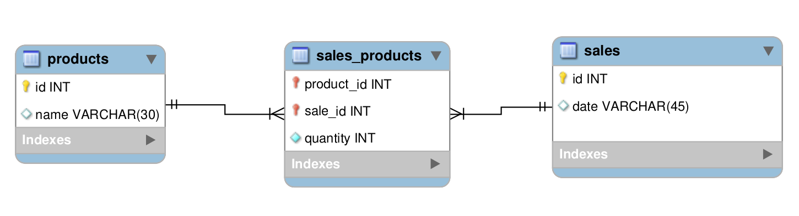
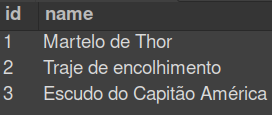
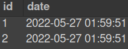
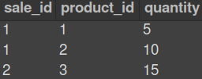

# Boas-vindas ao repositório do Projeto Store Manager! 

Para realizar o projeto, atente-se a cada passo descrito a seguir, e se tiver qualquer dúvida, nos envie por _Slack_! #vqv 🚀

Aqui você vai encontrar os detalhes de como estruturar o desenvolvimento do seu projeto a partir deste repositório, utilizando uma branch específica e um _Pull Request_ para colocar seus códigos.

## Termos e acordos

Ao iniciar este projeto, você concorda com as diretrizes do Código de Conduta e do Manual da Pessoa Estudante da Trybe.

# Entregáveis

<details>
  <summary><strong>🤷🏽‍♀️ Como entregar</strong></summary>

  Para entregar o seu projeto você deverá criar um *Pull Request* neste repositório.

  Lembre-se que você pode consultar nosso conteúdo sobre [Git & GitHub](https://app.betrybe.com/course/4d67f5b4-34a6-489f-a205-b6c7dc50fc16/) e nosso [Blog - Git & GitHub](https://blog.betrybe.com/tecnologia/git-e-github/) sempre que precisar!

  <br />
</details>

<details>
  <summary><strong>👨‍💻 O que deverá ser desenvolvido</strong></summary>

  Você vai desenvolver sua primeira API utilizando a arquitetura MSC (model-service-controller)!

  A API a ser construída é um sistema de gerenciamento de vendas no formato dropshipping em que será possível criar, visualizar, deletar e atualizar produtos e vendas. Você deverá utilizar o banco de dados MySQL para a gestão de dados. Além disso, a API deve ser RESTful.

  <br />
</details>

<details>
  <summary><strong>🗓 Data de Entrega</strong></summary>

  - Este projeto é individual
  - Serão `X` dias de projeto
  - Data de entrega para avaliação final do projeto: `DD/MM/YYYY - 14:00h`

    <br />
</details>

 <br />

# Orientações

<details>
  <summary><strong>:whale: Rodando no Docker vs Localmente</strong></summary>

  ## 👉 Com Docker

  **:warning: Antes de começar, seu docker-compose precisa estar na versão 1.29 ou superior. [Veja aqui](https://www.digitalocean.com/community/tutorials/how-to-install-and-use-docker-compose-on-ubuntu-20-04-pt) ou [na documentação](https://docs.docker.com/compose/install/) como instalá-lo. No primeiro artigo, você pode substituir onde está com `1.26.0` por `1.29.2`.**

  > :information_source: Rode os serviços `node` e `db` com o comando `docker-compose up -d`.
  - Lembre-se de parar o `mysql` se estiver usando localmente na porta padrão (`3306`), ou adapte, caso queria fazer uso da aplicação em containers;
  - Esses serviços irão inicializar um container chamado `store_manager` e outro chamado `store_manager_db`;
  - A partir daqui você pode rodar o container `store_manager` via CLI ou abri-lo no VS Code.

  >  :information_source: Use o comando `docker exec -it store_manager bash`.
  - Ele te dará acesso ao terminal interativo do container criado pelo compose, que está rodando em segundo plano.

  > :information_source: Instale as dependências [**Caso existam**] com `npm install`

  - **:warning: Atenção:** Caso opte por utilizar o Docker, **TODOS** os comandos disponíveis no `package.json` (npm start, npm test, npm run dev, ...) devem ser executados **DENTRO** do container, ou seja, no terminal que aparece após a execução do comando `docker exec` citado acima. 

  - **:warning: Atenção:** O **git** dentro do container não vem configurado com suas credenciais. Ou faça os commits fora do container, ou configure as suas credenciais do git dentro do container.

  - **:warning: Atenção:** Não rode o comando npm audit fix! Ele atualiza várias dependências do projeto, e essa atualização gera conflitos com o avaliador.

  - ✨ **Dica:** A extensão `Remote - Containers` (que estará na seção de extensões recomendadas do VS Code) é indicada para que você possa desenvolver sua aplicação no container Docker direto no VS Code, como você faz com seus arquivos locais.

  

 <br />

  ## 👉 Sem Docker

  > :information_source: Instale as dependências [**Caso existam**] com `npm install`

  - **:warning: Atenção:** Não rode o comando npm audit fix! Ele atualiza várias dependências do projeto, e essa atualização gera conflitos com o avaliador.

  - **:warning: Atenção:** Não esqueça de renomear/configurar o arquivo `.env.example` para os testes locais funcionarem.
  - **:warning: Atenção:** Para rodar o projeto desta forma, **obrigatoriamente** você deve ter o `Node.js` instalado em seu computador.
  - **:warning: Atenção:** A versão do `Node.js` e `NPM` a ser utilizada é `"node": ">=16.0.0"` e `"npm": ">=7.0.0"`, como descrito a chave `engines` no arquivo `package.json`

  <br/>
</details>

<details>
  <summary><strong>‼️ Antes de começar a desenvolver</strong></summary>

  1. Clone o repositório

  - `git clone git@github.com:betrybe/sd-0x-store-manager.git`;

  - Entre na pasta do repositório que você acabou de clonar:
    - `cd sd-0x-store-manager`

  2. Instale as dependências [**Caso existam**]

  - `npm install`

  #### :warning: ATENÇÃO: Não rode o comando `npm audit fix`! *Ele atualiza várias dependências do projeto, e essa atualização gera conflitos com o avaliador.*


  3. Crie uma branch a partir da branch `master`

  - Verifique que você está na branch `master`
    - Exemplo: `git branch`
  - Se não estiver, mude para a branch `master`
    - Exemplo: `git checkout master`
  - Agora crie uma branch à qual você vai submeter os `commits` do seu projeto
    - Você deve criar uma branch no seguinte formato: `nome-de-usuario-nome-do-projeto`
    - Exemplo: `git checkout -b joaozinho-sd-0x-store-manager`

  4. Adicione as mudanças ao _stage_ do Git e faça um `commit`

  - Verifique que as mudanças ainda não estão no _stage_
    - Exemplo: `git status` (deve aparecer listada a pasta _joaozinho_ em vermelho)
  - Adicione o novo arquivo ao _stage_ do Git
    - Exemplo:
      - `git add .` (adicionando todas as mudanças - _que estavam em vermelho_ - ao stage do Git)
      - `git status` (deve aparecer listado o arquivo _joaozinho/README.md_ em verde)
  - Faça o `commit` inicial
    - Exemplo:
      - `git commit -m 'iniciando o projeto x'` (fazendo o primeiro commit)
      - `git status` (deve aparecer uma mensagem tipo _nothing to commit_ )

  5. Adicione a sua branch com o novo `commit` ao repositório remoto

  - Usando o exemplo anterior: `git push -u origin joaozinho-sd-0x-store-manager`

  6. Crie um novo `Pull Request` _(PR)_

  - Vá até a página de _Pull Requests_ do [repositório no GitHub](https://github.com/tryber/sd-0x-store-manager/pulls)
  - Clique no botão verde _"New pull request"_
  - Clique na caixa de seleção _"Compare"_ e escolha a sua branch **com atenção**
  - Clique no botão verde _"Create pull request"_
  - Adicione uma descrição para o _Pull Request_ e clique no botão verde _"Create pull request"_
  - **Não se preocupe em preencher mais nada por enquanto!**
  - Volte até a [página de _Pull Requests_ do repositório](https://github.com/tryber/sd-0x-store-manager/pulls) e confira que o seu _Pull Request_ está criado

  <br />
</details>

<details>
  <summary><strong>⌨️ Durante o desenvolvimento</strong></summary>

  #### :warning: PULL REQUESTS COM ISSUES NO LINTER NÃO SERÃO AVALIADAS, ATENTE-SE PARA RESOLVÊ-LAS ANTES DE FINALIZAR O DESENVOLVIMENTO!

  * Faça `commits` das alterações que você fizer no código regularmente

  * Lembre-se de sempre após um (ou alguns) `commits` atualizar o repositório remoto

  * Os comandos que você utilizará com mais frequência são:
    1. `git status` _(para verificar o que está em vermelho - fora do stage - e o que está em verde - no stage)_
    2. `git add` _(para adicionar arquivos ao stage do Git)_
    3. `git commit` _(para criar um commit com os arquivos que estão no stage do Git)_
    5. `git push -u nome-da-branch` _(para enviar o commit para o repositório remoto na primeira vez que fizer o `push` de uma nova branch)_
    4. `git push` _(para enviar o commit para o repositório remoto após o passo anterior)_

  <br />
</details>

<details>
  <summary><strong>🤝 Depois de terminar o desenvolvimento (opcional)</strong></summary>

  Para **"entregar"** seu projeto, siga os passos a seguir:

  * Vá até a página **DO SEU** _Pull Request_, adicione a label de _"code-review"_ e marque seus colegas
    * No menu à direita, clique no _link_ **"Labels"** e escolha a _label_ **code-review**
    * No menu à direita, clique no _link_ **"Assignees"** e escolha **o seu usuário**
    * No menu à direita, clique no _link_ **"Reviewers"** e digite `students`, selecione o time `tryber/students-sd-00`

  Se ainda houver alguma dúvida sobre como entregar seu projeto, [aqui tem um video explicativo](https://vimeo.com/362189205).

  :warning: **Lembre-se que garantir que todas as _issues_ comentadas pelo _Lint_ estão resolvidas!**

  <br />
</details>

<details>
  <summary><strong>🕵🏿 Revisando um pull request</strong></summary>

  À medida que você e as outras pessoas que estudam na Trybe forem entregando os projetos, vocês receberão um alerta via Slack para também fazer a revisão dos Pull Requests de colegas. Fique atento às mensagens do "Pull Reminders" no Slack!

  Use o material que você já viu sobre [Code Review](https://app.betrybe.com/course/real-life-engineer/code-review) para te ajudar a revisar os projetos que chegaram para você.

  <br />
</details>

<details>
  <summary><strong>🛠 Execução de testes localmente</strong></summary>

  > :information_source: IMPORTANTE

  - Usaremos o [Jest](https://jestjs.io/pt-BR/) e o [Frisby](https://docs.frisbyjs.com/) para fazer os testes de API.
  - Na seção [Informações Importantes](#informacao-importante), está especificado como a conexão deve ser feita, para que os testes rodem.
  - Este projeto já vem configurado e com suas dependências.
  - Para poder executar os testes basta executar comando `npm test` *(lembre-se de que se estiver usando Docker, rodar esse comando dentro do container)*

  ### :eyes: De olho na Dica: executando os testes

  Para este projeto você pode rodar os testes das seguintes maneiras.
  - Executando todos: `npm test`
  - Executando um por vez: `npm test req02`
  - **:warning: Atenção:** lembre-se de que se estiver usando Docker, rodar esse comando dentro do container.

  <br />
</details>

<details>
  <summary><strong>🎛 Linter</strong></summary>

  Usaremos o [ESLint](https://eslint.org/) para fazer a análise estática do seu código.

  Este projeto já vem com as dependências relacionadas ao _linter_ configuradas no arquivos `package.json`.

  Para poder rodar os `ESLint` em um projeto basta executar o comando `npm install` dentro do projeto e depois `npm run lint`. Se a análise do `ESLint` encontrar problemas no seu código, tais problemas serão mostrados no seu terminal. Se não houver problema no seu código, nada será impresso no seu terminal.

  Você pode também instalar o plugin do `ESLint` no `VSCode`, basta baixar o [plugin `ESLint`](https://marketplace.visualstudio.com/items?itemName=dbaeumer.vscode-eslint) e instalá-lo

  <br />
</details>

<details>
  <summary id="informacao-importante"><strong>⚠️ Informações importantes sobre o projeto</strong></summary>

  - A pessoa usuária, independente de cadastro, deve conseguir:
    - Adicionar, ler, deletar e atualizar produtos;
    - Enviar vendas para o sistema e essas vendas devem validar se o produto em questão existe;
    - Ler, deletar e atualizar vendas.

  - Para **todos os endpoints** garanta que:
    - Caso o recurso **não seja encontrado**, **aconteça um erro** ou **haja dados inválidos** na sua requisição, sua API deve retornar o status HTTP adequado com o body `{ message: <mensagem de erro> }`;
    - Garanta que seus endpoints sempre retornem uma resposta, havendo sucesso nas operações ou não;
    - Garanta que seus endpoints sempre retornem os códigos de status corretos *(recurso criado, erro de validação, autorização, etc)*.
    - Use os verbos HTTP adequados para cada operação;
    - Agrupe e padronize suas URL em cada recurso;

  - Cada camada da sua API deve estar em seu respectivo diretório:
    - A camada **Models** deve estar no diretório de nome `models`;
    - A camada **Services** deve estar no diretório de nome `services`;
    - A camada **Controllers** deve estar no diretório de nome `controllers`;
    - Os **Middlewares** devem estar no diretório de nome `middlewares`.

  **:warning: Atenção:** Os diretórios já estão criados, não altere os nomes, não os mova de lugar e nem os deixe vazios. Você pode criar mais diretórios como `utils`, `helpers`, `database`... entre outros, mas não alterar os citados acima.

  - Em suas models:
    - Colocar o nome do banco de dados antes do nome da tabela, **ex: `banco_de_dados.tabela`**;
    - Atente-se a detalhes de digitação em seu código. Qualquer diferença em nomes, apelidos, CAIXA ALTA ou caixa baixa podem invalidar suas respostas.
    ```SQL
      -- exemplo de escrita de query
      SELECT * FROM StoreManager.products;
    ```

  ---

  ### :warning: Atenção aos arquivos entregues

  - Há um arquivo `app.js` no repositório, não remova o seguinte trecho de código:
    ```javascript
      app.get('/', (request, response) => {
        response.send();
      });

      module.exports = app;
    ```
    - Isso está configurado para o avaliador funcionar;
    - É neste arquivo que você irá configurar suas rotas.

  - Há um arquivo `index.js` no repositório, não altere a seguinte estrutura:
    ```Javascript
      const app = require('./app');
      require('dotenv').config();

      // não altere esse arquivo, essa estrutura é necessária para à avaliação do projeto

      app.listen(process.env.PORT, () => {
        console.log(`Escutando na porta ${process.env.PORT}`);
      });
    ```
    - Isso está configurado para tornar os testes unitários mais fáceis de serem executados.

  ---

  ### :warning: Atenção aos arquivos de variáveis de ambiente

  - Para os testes rodarem corretamente, na raiz do projeto **renomeie o arquivo `.env.example` para `.env`** com as variáveis de ambiente. Por exemplo, caso o seu usuário SQL seja `nome` e a senha `1234` seu arquivo ficará desta forma:
    ```sh
      MYSQL_HOST=localhost
      MYSQL_USER=nome
      MYSQL_PASSWORD=1234
      MYSQL_DATABASE=StoreManager
      PORT=3000
    ```
    - **Variáveis de ambiente além das especificadas acima não são suportadas, pois não são esperadas pelo avaliador do projeto.**
      - A variável **PORT** do arquivo `.env` deve ser utilizada para a conexão com o servidor. É importante utilizar essa variável para os testes serem executados corretamente tanto na máquina local quanto no avaliador.
    - Com essas configurações, enquanto estiver na máquina local, o banco será executado normalmente via localhost (possibilitando os testes via `npm test`).
    Como o arquivo `.env` não será enviado para o GitHub (não se preocupe com isso, pois já está configurado no `.gitignore`), o avaliador utilizará as suas próprias variáveis de ambiente.
    ```javascript
    require('dotenv').config(); // não se esqueça de configurar suas variáveis de ambiente aqui na configuração

      const connection = mysql.createPool({
        host: process.env.MYSQL_HOST,
        user: process.env.MYSQL_USER,
        password: process.env.MYSQL_PASSWORD,
        database: process.env.MYSQL_DATABASE || 'StoreManager',
      });
    ```

  <br />
</details>

<details>
  <summary id="dicas"><strong>👀 Dicas</strong></summary>

  - Para gerar os objetos de erro personalizados, você pode utilizar uma biblioteca de erros, como o [`boom`](https://www.npmjs.com/package/@hapi/boom) ou [`restify-errors`](https://www.npmjs.com/package/restify-errors);

  - Você pode utilizar middlewares e objetos de erro personalizados para que não tenha que repetir a lógica de tratamento de erro em vários lugares. Não se esqueça também do [`express-rescue`](https://www.npmjs.com/package/express-rescue), ele pode facilitar muito o trabalho de tratar erros;

  - Quando estiver na dúvida sobre qual status HTTP utilizar, você pode consultar a [documentação sobre o assunto no MDN](https://developer.mozilla.org/pt-BR/docs/Web/HTTP/Status). Com o tempo, você vai lembrar com facilidade o significado dos códigos mais comuns;

  - Para realizar a validação dos dados, você pode utilizar pacotes como [`Joi`](https://www.npmjs.com/package/joi) ou o [`Expresso Validator`](https://www.npmjs.com/package/@expresso/validator). Caso prefira, você também pode realizar a validação de forma manual.

  - Para este projeto, é importante recorrer a leitura e fazer os exercícios do dia [Arquitetura de Software - Camada de Controller e Service](https://app.betrybe.com/course/back-end/nodejs-camada-de-servico-e-arquitetura-rest-e-restful/arquitetura-de-software-camada-de-controller-e-service/f8eeda7e-dd20-4a59-a0d9-3d4ec20729bc) *(Especialmente a seção `Bônus` > `Inserindo dados em mais de uma tabela`)*

  <br />
</details>

<details>
  <summary id="diagrama-scripts"><strong>🎲 Diagrama ER, Entidades e Scripts</strong></summary>

  #### Diagrama de Entidade-Relacionamento

  Para orientar a manipulação das tabelas, utilize o DER a seguir:

  

  ---

  #### Tabelas

  O banco terá três tabelas: 
  - A tabela `products`, com os atributos `id` e `name`;
  - A tabela `sales`, com os atributos `id` e `date`;
  - A tabela `sales_products`, com os atributos `sale_id`, `product_id` e `quantity`;
  - O script de criação do banco de dados pode ser visto [aqui](migration.sql);
  - O script que popula o banco de dados pode ser visto [aqui](seed.sql);

  **:warning: Atenção:** Não exclua, altere ou mova de lugar os arquivos `migration.sql` e `seed.sql`, eles são usados para realizar os testes. Qualquer dúvida sobre estes arquivos procure a monitoria no Slack ou nas mentorias.

  A tabela `products` tem o seguinte formato: *(O id será gerado automaticamente)*

  

  A tabela `sales` tem o seguinte formato: *(O id e date são gerados automaticamente)*

  


  A tabela `sales_products`, é a tabela que faz o relacionamento `N:N` entre `products` e `sales` e tem o seguinte formato: *(O produto e a venda são deletados automaticamente)*

  

  > :warning:️ Em caso de dúvidas, consulte os conteúdos:
  > - [Arquitetura de Software - Camada de Model](https://app.betrybe.com/course/back-end/nodejs-camada-de-servico-e-arquitetura-rest-e-restful/arquitetura-de-software-camada-de-model/69147096-f19d-4ab4-a839-906359d79172/o-que-vamos-aprender/989bb9ca-4adb-4b12-a26e-4f74c26c2e90?use_case=calendar)
  > - [Arquitetura de Software - Camada de Controller e Service](https://app.betrybe.com/course/back-end/nodejs-camada-de-servico-e-arquitetura-rest-e-restful/arquitetura-de-software-camada-de-controller-e-service/f8eeda7e-dd20-4a59-a0d9-3d4ec20729bc/o-que-vamos-aprender/af063606-77cb-4fbc-9c93-992662283b5a?use_case=side_bar)

  ---

  #### Dicas de scripts prontos

  - Criar o banco de dados e gerar as tabelas:
  ```sh
    npm run migration
  ```

  - Limpar e popular o banco de dados:
  ```sh
    npm run seed
  ```

  - Iniciar o servidor Node:
  ```sh
    npm start
  ```

  - Iniciar o servidor Node com nodemon:
  ```sh
    npm run debug
  ```

  - Executar os testes avaliativos da Trybe:
  ```sh
    npm test
  ```

  - Executar os testes de unidade escritos por você:
  ```sh
    npm run test:mocha
  ```

  - Executar o linter:
  ```sh
    npm run lint
  ```

  **:warning: Atenção:** A alteração desses scripts pode impedir o avaliador de funcionar corretamente.

  <br />
</details>

<details id="para-escrever-seus-própios-arquivos-de-teste">
  <summary><strong>🔬 Escrevendo testes de unidade</strong></summary><br />

  - Utilize o **mocha**, **chai** e **sinon** para escrever seus testes;
  - Coloque todos os testes de `models`, `services` e `controllers` dentro da pasta `tests/unit`.
  - **:warning: Atenção:** Os nomes dos arquivos de testes devem seguir essa estrutura `nomeDoArquivo.test.js`
  - **✨ Dica:** Aqui uma sugestão de arquivos para criar os teste de unidade:
  ```tree
  .
  ├─ ...
  ├─ tests
  │   └─ unit
  |       ├─ controllers
  │            ├─ productsControllers.test.js
  │            └─ salesControllers.test.js
  |       ├─ services
  │            ├─ productsServices.test.js
  │            └─ salesServices.test.js
  |       └─ models
  │            ├─ productsModels.test.js
  │            └─ salesModels.test.js
  └─ ...
  ```
  - **✨ Dica:** Aqui como dica, é interessante começar a escrever seus testes de unidade pela camada de `models`. Outra dica é não escrever todos os testes de uma camada só de uma vez! Ex: Crie a função de listar todos os produtos, escreva o teste da camada de `models`, depois `service`, por último `controllers` e vai para a próxima função...

  <br />
</details>

<details>
  <summary><strong>🗣 Nos dê feedbacks sobre o projeto!</strong></summary>

Ao finalizar e submeter o projeto, não se esqueça de avaliar sua experiência preenchendo o formulário.
**Leva menos de 3 minutos!**

[FORMULÁRIO DE AVALIAÇÃO DE PROJETO](https://be-trybe.typeform.com/to/ZTeR4IbH)

:warning: **O avaliador automático não necessariamente avalia seu projeto na ordem em que os requisitos aparecem no readme. Isso acontece para deixar o processo de avaliação mais rápido. Então, não se assuste se isso acontecer, ok?**

  <br />
</details>

<details>
  <summary><strong>🗂 Compartilhe seu portfólio!</strong></summary>

  Você sabia que o LinkedIn é a principal rede social profissional e compartilhar o seu aprendizado lá é muito importante para quem deseja construir uma carreira de sucesso? Compartilhe esse projeto no seu LinkedIn, marque o perfil da Trybe (@trybe) e mostre para a sua rede toda a sua evolução.

  <br />
</details>

# Requisitos Obrigatórios

## 01 - Crie endpoints para listar produtos

- O endpoint para listar produtos deve ser acessível através do caminho (`/products`) e (`/products/:id`);
- Através do caminho `/products`, todos os produtos devem ser retornados;
- Através do caminho `/products/:id`, apenas o produto com o `id` presente na URL deve ser retornado;
- O resultado da listagem deve ser **ordernado** de forma crescente pelo campo `id`;

<details close>
  <summary>Os seguintes pontos serão avaliados</summary>

  - **[Será validado que é possível listar todos os produtos]**
    - Ao listar usuários com sucesso o resultado retornado deverá ser conforme exibido abaixo, com um status http `200`:
    ```json
      [
        {
          "id": 1,
          "name": "Martelo de Thor",
        },
        {
          "id": 2,
          "name": "Traje de encolhimento",
        }
        /* ... */
      ]
    ```
  
  - **[Será validado que não é possível listar um produto que não existe]**
    - Se o produto for inexistente o resultado retornado deverá ser conforme exibido abaixo, com um status http `404`:
    ```json
      { "message": "Product not found" }
    ```

  - **[Será validado que é possível listar um produto específico com sucesso]**
    - Ao listar um produto com sucesso o resultado retornado deverá ser conforme exibido abaixo, com um status http `200`:
    ```json
      {
        "id": 1,
        "name": "Martelo de Thor",
      }
    ```

  <br>
</details>

---

## 02 - Desenvolva testes que cubram no mínimo 5% das camadas da sua aplicação

- Seus arquivos de teste devem ficar no diretório `tests/unit`, como é descrito em [Para escrever seus próprios arquivos de teste](#para-escrever-seus-própios-arquivos-de-teste);
- Seus testes da `model` devem fazer mock do banco de dados obrigatóriamente;
- Opcionalmente você pode parar o serviço do `MYSQL` em sua máquina. Para rodar seus teste utilize `npm run test:mocha`;
- Antes de executar os testes da Trybe, seus testes não devem conter erros.

<details close>
  <summary>Os seguintes pontos serão avaliados</summary>

  - **[Será validado que a cobertura total das linhas dos arquivos de CADA camada `models`, `services` e `controllers` é maior ou igual a 5%. Ou seja, cada uma das camadas tem de ter, ao menos, 5% de cobertura de testes.]**

  <br>
</details>

---

## 03 - Crie endpoint para cadastrar produtos

- O endpoint deve ser acessível através do caminho (`/products`);
- Os produtos enviados devem ser salvos na tabela `products` do banco de dados;
- O corpo da requisição deverá seguir o formato abaixo:
```json
  {
    "name": "ProdutoX"
  }
```

<details close>
  <summary>Os seguintes pontos serão avaliados</summary>

  - **[Será validado que é possível cadastrar um produto com sucesso]**
    - Se o produto for criado com sucesso o resultado retornado deverá ser conforme exibido abaixo, com um status http `201`:
    ```json
      {
        "id": 4,
        "name": "ProdutoX"
      }
    ```

  <br>
</details>

---

## 04 - Crie validações para produtos

- O endpoint de produtos deve ser acessível através do caminho (`/products`);
- Lembre-se, o banco de dados não deve ser acessado nas validações iniciais do corpo da requisição;

<details close>
  <summary>Os seguintes pontos serão avaliados</summary>

  - **[Será validado que não é possível realizar operações em um produto sem o campo `name`]**
    - Se a requisição não tiver o campo `name`, o resultado retornado deverá ser conforme exibido abaixo, com um status http `400` :
    ```json
      { "message": "\"name\" is required" }
    ```

  - **[Será validado que não é possível realizar operações em um produto com o campo `name` menor que 5 caracteres]**
    - Se a requisição não tiver `name` com pelo menos 5 caracteres, o resultado retornado deverá ser conforme exibido abaixo, com um status http `422`
    ```json
      { "message": "\"name\" length must be at least 5 characters long" }
    ```

  <br>
</details>

---

## 05 - Desenvolva testes que cubram no mínimo 10% das camadas da sua aplicação

- Seus arquivos de teste devem ficar no diretório `tests/unit`, como é descrito em [Para escrever seus próprios arquivos de teste](#para-escrever-seus-própios-arquivos-de-teste);
- Seus testes da `model` devem fazer mock do banco de dados obrigatóriamente;
- Opcionalmente você pode parar o serviço do `MYSQL` em sua máquina. Para rodar seus teste utilize `npm run test:mocha`;
- Antes de executar os testes da Trybe, seus testes não devem conter erros.

<details close>
  <summary>Os seguintes pontos serão avaliados</summary>

  - **[Será validado que a cobertura total das linhas dos arquivos de CADA camada `models`, `services` e `controllers` é maior ou igual a 10%. Ou seja, cada uma das camadas tem de ter, ao menos, 10% de cobertura de testes.]**

  <br>
</details>

---

## 06 - Crie endpoint para validar e cadastrar vendas

- O endpoint de vendas deve ser acessível através do caminho (`/sales`);
- As vendas enviadas devem ser salvas nas tabelas `sales` e `sales_products` do banco de dados;
- Deve ser possível cadastrar a venda de vários produtos através da uma mesma requisição;
- O corpo da requisição deverá seguir o formato abaixo:
```json
  [
    {
      "productId": 1,
      "quantity":1
    },
    {
      "productId": 2,
      "quantity":5
    }
  ]
```

<details close>
  <summary>Os seguintes pontos serão avaliados</summary>

  - **[Será validado que não é possível realizar operações em uma venda sem o campo `productId`]**
    - Se algum dos itens da requisição não tiver o campo `productId`, o resultado retornado deverá ser conforme exibido abaixo, com um status http `400`:
    ```json
      { "message": "\"productId\" is required" }
    ```
  
  - **[Será validado que não é possível realizar operações em uma venda sem o campo `quantity`]**
    - Se algum dos itens da requisição não tiver o campo `quantity`, o resultado retornado deverá ser conforme exibido abaixo, com um status http `400` :
    ```json
      { "message": "\"quantity\" is required" }
    ```
  
  - **[Será validado que não é possível realizar operações em uma venda com o campo `quantity` menor ou igual a 0 (Zero)]**
    - Se a requisição tiver algum item em que o campo `quantity` seja menor ou igual a zero, o resultado retornado deverá ser conforme exibido abaixo, com um status http `422`
    ```json
      { "message": "\"quantity\" must be greater than or equal to 1" }
    ```

  - **[Será validado que não é possível realizar operações em uma venda com o campo `productId` inexistente, em uma requisição com um único item]**
    - Se o campo `productId` do item da requisição não existir no banco de dados, o resultado retornado deverá ser conforme exibido abaixo, com um status http `404`
    ```json
      { "message": "Product not found" }
    ```

  - **[Será validado que não é possível realizar operações em uma venda com o campo `productId` inexistente, em uma requisição com vários items]**
    - Se a requisição tiver algum item cujo campo `productId` não existe no banco de dados, o resultado retornado deverá ser conforme exibido abaixo, com um status http `404`
    ```json
      { "message": "Product not found" }
    ```
  
  - **[Será validado que é possível cadastrar uma venda com sucesso]**
    - Se a venda for criada com sucesso o resultado retornado deverá ser conforme exibido abaixo, com um status http `201`:
    ```json
      {
        "id": 3,
        "itemsSold": [
          {
            "productId": 1,
            "quantity":1
          },
          {
            "productId": 2,
            "quantity":5
          }
        ]
      }
    ```

  <br>
</details>

> 💬 Em caso de dúvidas, lembre-se de consultar a seção [Dicas](#dicas) e [Diagrama ER, Entidades e Scripts](#diagrama-scripts)

---

## 07 - Desenvolva testes que cubram no mínimo 15% das camadas da sua aplicação

- Seus arquivos de teste devem ficar no diretório `tests/unit`, como é descrito em [Para escrever seus próprios arquivos de teste](#para-escrever-seus-própios-arquivos-de-teste);
- Seus testes da `model` devem fazer mock do banco de dados obrigatóriamente;
- Opcionalmente você pode parar o serviço do `MYSQL` em sua máquina. Para rodar seus teste utilize `npm run test:mocha`;
- Antes de executar os testes da Trybe, seus testes não devem conter erros.

<details close>
  <summary>Os seguintes pontos serão avaliados</summary>

  - **[Será validado que a cobertura total das linhas dos arquivos de CADA camada `models`, `services` e `controllers` é maior ou igual a 15%. Ou seja, cada uma das camadas tem de ter, ao menos, 15% de cobertura de testes.]**

  <br>
</details>

---

## 08 - Crie endpoints para listar vendas

- O endpoint para listar vendas deve ser acessível através do caminho (`/sales`) e (`/sales/:id`);
- Através do caminho `/sales`, todas as vendas devem ser retornadas;
- Através do caminho `/sales/:id`, apenas a venda com o `id` presente na URL deve ser retornada;
- o resultado deve ser **ordernado** de forma crescente pelo campo `saleId`, em caso de empate, **ordernar** também de forma crescente pelo campo `productId`;

<details close>
  <summary>Os seguintes pontos serão avaliados</summary>

  - **[Será validado que é possível listar todas as vendas]**
    - Ao listar vendas com sucesso o resultado retornado deverá ser conforme exibido abaixo, com um status http `200`:
    ```json
      [
        {
          "saleId": 1,
          "date": "2021-09-09T04:54:29.000Z",
          "productId": 1,
          "quantity": 2
        },
        {
          "saleId": 1,
          "date": "2021-09-09T04:54:54.000Z",
          "productId": 2,
          "quantity": 2
        }

        /* ... */
      ]
    ```
  
  - **[Será validado que não é possível listar uma venda que não existe]**
    - Se a venda for inexistente o resultado retornado deverá ser conforme exibido abaixo, com um status http `404`:
    ```json
      { "message": "Sale not found" }
    ```

  - **[Será validado que é possível listar uma venda específica com sucesso]**
    - Ao listar uma venda com sucesso o resultado retornado deverá ser conforme exibido abaixo, com um status http `200`:
    ```json
      [
        {
          "date": "2021-09-09T04:54:29.000Z",
          "productId": 1,
          "quantity": 2
        },
        {
          "date": "2021-09-09T04:54:54.000Z",
          "productId": 2,
          "quantity": 2
        }

        /* ... */
      ]
    ```

  <br>
</details>

---

## 09 - Desenvolva testes que cubram no mínimo 20% das camadas da sua aplicação

- Seus arquivos de teste devem ficar no diretório `tests/unit`, como é descrito em [Para escrever seus próprios arquivos de teste](#para-escrever-seus-própios-arquivos-de-teste);
- Seus testes da `model` devem fazer mock do banco de dados obrigatóriamente;
- Opcionalmente você pode parar o serviço do `MYSQL` em sua máquina. Para rodar seus teste utilize `npm run test:mocha`;
- Antes de executar os testes da Trybe, seus testes não devem conter erros.

<details close>
  <summary>Os seguintes pontos serão avaliados</summary>

  - **[Será validado que a cobertura total das linhas dos arquivos de CADA camada `models`, `services` e `controllers` é maior ou igual a 20%. Ou seja, cada uma das camadas tem de ter, ao menos, 20% de cobertura de testes.]**

  <br>
</details>

---

## 10 - Crie endpoint para atualizar um produto

- O endpoint deve ser acessível através do caminho (`/products/:id`);
- Apenas o produto com o `id` presente na URL deve ser atualizado;
- O corpo da requisição deve ser validado igual no cadastro;
- O corpo da requisição deverá seguir o formato abaixo:
```json
  {
    "name": "Martelo do Batman"
  }
```

<details close>
  <summary>Os seguintes pontos serão avaliados</summary>
  
  - **[Será validado que não é possível alterar um produto que não existe]**
    - Se o produto for inexistente o resultado retornado deverá ser conforme exibido abaixo, com um status http `404`:
    ```json
      { "message": "Product not found" }
    ```

  - **[Será validado que é possível alterar um produto com sucesso]**
    - Se o produto for alterado com sucesso o resultado retornado deverá ser conforme exibido abaixo, com um status http `200`:
    ```json
      {
        "id": 1,
        "name": "Martelo do Batman"
      }
    ```

  <br>
</details>

---

## 11 - Desenvolva testes que cubram no mínimo 25% das camadas da sua aplicação

- Seus arquivos de teste devem ficar no diretório `tests/unit`, como é descrito em [Para escrever seus próprios arquivos de teste](#para-escrever-seus-própios-arquivos-de-teste);
- Seus testes da `model` devem fazer mock do banco de dados obrigatóriamente;
- Opcionalmente você pode parar o serviço do `MYSQL` em sua máquina. Para rodar seus teste utilize `npm run test:mocha`;
- Antes de executar os testes da Trybe, seus testes não devem conter erros.

<details close>
  <summary>Os seguintes pontos serão avaliados</summary>

  - **[Será validado que a cobertura total das linhas dos arquivos de CADA camada `models`, `services` e `controllers` é maior ou igual a 25%. Ou seja, cada uma das camadas tem de ter, ao menos, 25% de cobertura de testes.]**

  <br>
</details>

---

## 12 - Crie endpoint para deletar um produto

- O endpoint deve ser acessível através do caminho (`/products/:id`);
- Apenas o produto com o `id` presente na URL deve ser deletado;

<details close>
  <summary>Os seguintes pontos serão avaliados</summary>
  
  - **[Será validado que não é possível deletar um produto que não existe]**
    - Se o produto for inexistente o resultado retornado deverá ser conforme exibido abaixo, com um status http `404`:
    ```json
      { "message": "Product not found" }
    ```

  - **[Será validado que é possível deletar um produto com sucesso]**
    - Se o produto for deletado com sucesso não deve ser retornada nenhuma resposta, apenas um status http `204`;

  <br>
</details>

> 💬 Em caso de dúvidas, lembre-se de consultar a seção [Diagrama ER, Entidades e Scripts](#diagrama-scripts)

---

# Requisitos Bônus

## 13 - Desenvolva testes que cubram no mínimo 30% das camadas da sua aplicação

- Seus arquivos de teste devem ficar no diretório `tests/unit`, como é descrito em [Para escrever seus próprios arquivos de teste](#para-escrever-seus-própios-arquivos-de-teste);
- Seus testes da `model` devem fazer mock do banco de dados obrigatóriamente;
- Opcionalmente você pode parar o serviço do `MYSQL` em sua máquina. Para rodar seus teste utilize `npm run test:mocha`;
- Antes de executar os testes da Trybe, seus testes não devem conter erros.

<details close>
  <summary>Os seguintes pontos serão avaliados</summary>

  - **[Será validado que a cobertura total das linhas dos arquivos de CADA camada `models`, `services` e `controllers` é maior ou igual a 30%. Ou seja, cada uma das camadas tem de ter, ao menos, 30% de cobertura de testes.]**

  <br>
</details>

---

## 14 - Crie endpoint para deletar uma venda

- O endpoint deve ser acessível através do caminho (`/sales/:id`);
- Apenas a venda com o `id` presente na URL deve ser deletado;

<details close>
  <summary>Os seguintes pontos serão avaliados</summary>
  
  - **[Será validado que não é possível deletar uma venda que não existe]**
    - Se a venda for inexistente o resultado retornado deverá ser conforme exibido abaixo, com um status http `404`:
    ```json
      { "message": "Sale not found" }
    ```

  - **[Será validado que é possível deletar uma venda com sucesso]**
    - Se a venda for deletada com sucesso não deve ser retornada nenhuma resposta, apenas um status http `204`;

  <br>
</details>

> 💬 Em caso de dúvidas, lembre-se de consultar a seção [Diagrama ER, Entidades e Scripts](#diagrama-scripts)

---

## 15 - Desenvolva testes que cubram no mínimo 35% das camadas da sua aplicação

- Seus arquivos de teste devem ficar no diretório `tests/unit`, como é descrito em [Para escrever seus próprios arquivos de teste](#para-escrever-seus-própios-arquivos-de-teste);
- Seus testes da `model` devem fazer mock do banco de dados obrigatóriamente;
- Opcionalmente você pode parar o serviço do `MYSQL` em sua máquina. Para rodar seus teste utilize `npm run test:mocha`;
- Antes de executar os testes da Trybe, seus testes não devem conter erros.

<details close>
  <summary>Os seguintes pontos serão avaliados</summary>

  - **[Será validado que a cobertura total das linhas dos arquivos de CADA camada `models`, `services` e `controllers` é maior ou igual a 35%. Ou seja, cada uma das camadas tem de ter, ao menos, 35% de cobertura de testes.]**

  <br>
</details>

---

## 16 - Crie endpoint para atualizar uma venda

- O endpoint deve ser acessível através do caminho (`/sales/:id`);
- Apenas a venda com o `id` presente na URL deve ser atualizada;
- O corpo da requisição deve ser validado igual no cadastro;
- O corpo da requisição deverá seguir o formato abaixo:
```json
  [
    {
      "productId": 1,
      "quantity":10
    },
    {
      "productId": 2,
      "quantity":50
    }
  ]
```
<details close>
  <summary>Os seguintes pontos serão avaliados</summary>
  
  - **[Será validado que não é possível alterar uma venda que não existe]**
    - Se a venda for inexistente o resultado retornado deverá ser conforme exibido abaixo, com um status http `404`:
    ```json
      { "message": "Product not found" }
    ```

  - **[Será validado que é possível alterar uma venda com sucesso]**
    - Se a venda for alterada com sucesso o resultado retornado deverá ser conforme exibido abaixo, com um status http `200`:
    ```json
      "saleId": 1,
        "itemsUpdated": [
          {
            "productId": 1,
            "quantity":10
          },
          {
            "productId": 2,
            "quantity":50
          }
        ]
    ```

  <br>
</details>

---

## 17 - Desenvolva testes que cubram no mínimo 40% das camadas da sua aplicação

- Seus arquivos de teste devem ficar no diretório `tests/unit`, como é descrito em [Para escrever seus próprios arquivos de teste](#para-escrever-seus-própios-arquivos-de-teste);
- Seus testes da `model` devem fazer mock do banco de dados obrigatóriamente;
- Opcionalmente você pode parar o serviço do `MYSQL` em sua máquina. Para rodar seus teste utilize `npm run test:mocha`;
- Antes de executar os testes da Trybe, seus testes não devem conter erros.

<details close>
  <summary>Os seguintes pontos serão avaliados</summary>

  - **[Será validado que a cobertura total das linhas dos arquivos de CADA camada `models`, `services` e `controllers` é maior ou igual a 40%. Ou seja, cada uma das camadas tem de ter, ao menos, 40% de cobertura de testes.]**

  <br>
</details>

---

## 18 - Crie endpoint products/search?q=searchTerm

- O endpoint deve ser acessível através do URL `/products/search`;
- O endpoint deve ser capaz de trazer os produtos baseados no `q` do banco de dados, se ele existir;
- Sua aplicação deve ser capaz de retornar um array de produtos que contenham em seu nome termo passado na URL;
- Sua aplicação deve ser capaz de retornar um array vázio caso nenhum nome satisfaça a busca;
- O query params da requisição deverá seguir o formato abaixo:
  ```js
    http://localhost:PORT/products/search?q=Martelo
  ```

<details>
  <summary><strong>Os seguintes pontos serão avaliados</strong></summary>

  - **[Será validado que é possível buscar um produto pelo `name`]**
    - Se a buscar for feita com sucesso, o resultado retornado deverá ser conforme exibido abaixo, com um status http `200`:
    ```json
      // GET /products/search?q=Martelo

      [
        {
          "id": 1,
          "name": "Martelo de Thor",
        }
      ]
    ```

  - **[Será validado que é possível buscar todos os produtos quando passa a busca vazia]**
    - Se a buscar for vazia o resultado retornado deverá ser conforme exibido abaixo, com um status http `200`:
    ```json
      // GET /products/search?q=

      [
        {
          "id": 1,
          "name": "Martelo de Thor",
        },
        {
          "id": 2,
          "name": "Traje de encolhimento",
        }
        /* ... */
      ]
    ```
</details>

---

## 19 - Desenvolva testes que cubram no mínimo 50% das camadas da sua aplicação

- Seus arquivos de teste devem ficar no diretório `tests/unit`, como é descrito em [Para escrever seus próprios arquivos de teste](#para-escrever-seus-própios-arquivos-de-teste);
- Seus testes da `model` devem fazer mock do banco de dados obrigatóriamente;
- Opcionalmente você pode parar o serviço do `MYSQL` em sua máquina. Para rodar seus teste utilize `npm run test:mocha`;
- Antes de executar os testes da Trybe, seus testes não devem conter erros.

<details close>
  <summary>Os seguintes pontos serão avaliados</summary>

  - **[Será validado que a cobertura total das linhas dos arquivos de CADA camada `models`, `services` e `controllers` é maior ou igual a 50%. Ou seja, cada uma das camadas tem de ter, ao menos, 50% de cobertura de testes.]**

  <br>
</details>

---

## 20 - Desenvolva testes que cubram no mínimo 60% das camadas da sua aplicação

- Seus arquivos de teste devem ficar no diretório `tests/unit`, como é descrito em [Para escrever seus próprios arquivos de teste](#para-escrever-seus-própios-arquivos-de-teste);
- Seus testes da `model` devem fazer mock do banco de dados obrigatóriamente;
- Opcionalmente você pode parar o serviço do `MYSQL` em sua máquina. Para rodar seus teste utilize `npm run test:mocha`;
- Antes de executar os testes da Trybe, seus testes não devem conter erros.

<details close>
  <summary>Os seguintes pontos serão avaliados</summary>

  - **[Será validado que a cobertura total das linhas dos arquivos de CADA camada `models`, `services` e `controllers` é maior ou igual a 60%. Ou seja, cada uma das camadas tem de ter, ao menos, 60% de cobertura de testes.]**

  <br>
</details>